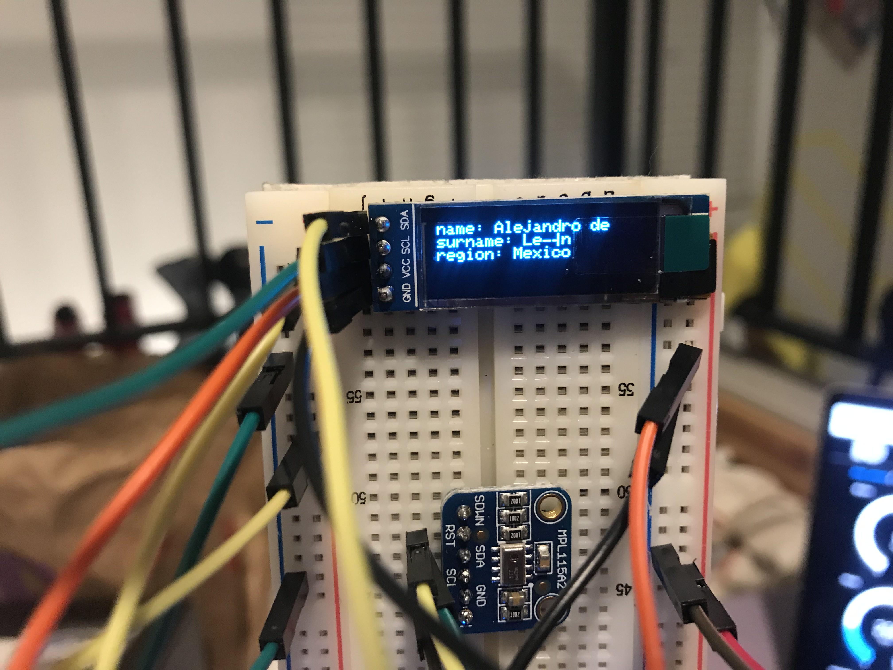

## __Pot Names__
Tool for generating random _names_, _surenames_, and _regions_ by turning a potentiometer knob.   

## __Hardware__

The following parts are needed for this project:

- 1x Adafruit IO compatible Feather
- 1x potentiometer
- 1x RGB LED
- 1x OLED module
- Some jumper wires

## __Output__
If you followed all of the instructions, then your output should look a little something like this:

# **Bi-directional Communication with your Adafruit IO Dashboard**
 Program for sending color data from Adafruit IO to a RGB LED.

 ## __Hardware__

 The following parts are needed for this project:

- 1x Adafruit IO compatible Feather
- 1x diffused RGB LED - common anode
- 3x 560 ohm resistors
- 4x jumper wires
